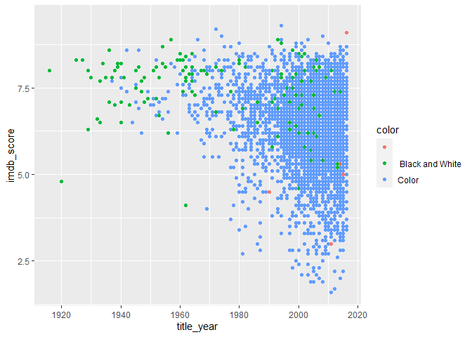

Project proposal
================
Group 6

``` r
library(tidyverse)
```

    ## Warning: package 'tidyverse' was built under R version 4.1.3

    ## Warning: replacing previous import 'lifecycle::last_warnings' by
    ## 'rlang::last_warnings' when loading 'pillar'

    ## Warning: package 'tibble' was built under R version 4.1.3

    ## Warning: package 'tidyr' was built under R version 4.1.3

    ## Warning: package 'readr' was built under R version 4.1.3

``` r
library(broom)
```

    ## Warning: package 'broom' was built under R version 4.1.3

``` r
library(ggplot2)
```

## 1. Introduction

What will be the rating of a movie based on director, genre, actor and
budget? We are trying to build a movie rating recommendation system
based on certain variables in the dataset.Our selection of the predictor
variables are based on intuition as we think these are the factors which
influence a movie rating in a real world scenario.We would like to
explore these variables further and build the linear regression model to
check how accurate or far off we are in choosing these variables for
movie rating prediction.

The dataset has been taken from Kaggle and consists of IMDB movie
information. It is a well rounded dataset with both numerical and
categorical variables. We are going to analyze each and every factors
which can influence the IMDB ratings so that we can predict better
results.As our entire team consists of extreme movie buffs we thought we
could work on predicting the rating of a movie and see how that works!
Below is a brief overview of our project plan:

1.EDA of the dataset to analyze the data before coming to any assumptions 

2.Build visualizations to identify patterns, trends and outliers 

3.Find a correlation between the IMDB score and other variables in the dataset to shortlist those with stronger correlations as numerical predictors for our movie rating. 

4.Build a linear regression model to analyze the relationship between the outcome and predictor variables. 

5.We plan to use another model (to be decided later) to compare the accuracy between the two models.

## 2. Data

``` r
data <- read.csv("../data/movie_metadata.csv")
glimpse(data)
```

    ## Rows: 5,043
    ## Columns: 28
    ## $ color                     <chr> "Color", "Color", "Color", "Color", "", "Col~
    ## $ director_name             <chr> "James Cameron", "Gore Verbinski", "Sam Mend~
    ## $ num_critic_for_reviews    <int> 723, 302, 602, 813, NA, 462, 392, 324, 635, ~
    ## $ duration                  <int> 178, 169, 148, 164, NA, 132, 156, 100, 141, ~
    ## $ director_facebook_likes   <int> 0, 563, 0, 22000, 131, 475, 0, 15, 0, 282, 0~
    ## $ actor_3_facebook_likes    <int> 855, 1000, 161, 23000, NA, 530, 4000, 284, 1~
    ## $ actor_2_name              <chr> "Joel David Moore", "Orlando Bloom", "Rory K~
    ## $ actor_1_facebook_likes    <int> 1000, 40000, 11000, 27000, 131, 640, 24000, ~
    ## $ gross                     <int> 760505847, 309404152, 200074175, 448130642, ~
    ## $ genres                    <chr> "Action|Adventure|Fantasy|Sci-Fi", "Action|A~
    ## $ actor_1_name              <chr> "CCH Pounder", "Johnny Depp", "Christoph Wal~
    ## $ movie_title               <chr> "Avatar ", "Pirates of the Caribbean: At Wo~
    ## $ num_voted_users           <int> 886204, 471220, 275868, 1144337, 8, 212204, ~
    ## $ cast_total_facebook_likes <int> 4834, 48350, 11700, 106759, 143, 1873, 46055~
    ## $ actor_3_name              <chr> "Wes Studi", "Jack Davenport", "Stephanie Si~
    ## $ facenumber_in_poster      <int> 0, 0, 1, 0, 0, 1, 0, 1, 4, 3, 0, 0, 1, 2, 1,~
    ## $ plot_keywords             <chr> "avatar|future|marine|native|paraplegic", "g~
    ## $ movie_imdb_link           <chr> "http://www.imdb.com/title/tt0499549/?ref_=f~
    ## $ num_user_for_reviews      <int> 3054, 1238, 994, 2701, NA, 738, 1902, 387, 1~
    ## $ language                  <chr> "English", "English", "English", "English", ~
    ## $ country                   <chr> "USA", "USA", "UK", "USA", "", "USA", "USA",~
    ## $ content_rating            <chr> "PG-13", "PG-13", "PG-13", "PG-13", "", "PG-~
    ## $ budget                    <dbl> 237000000, 300000000, 245000000, 250000000, ~
    ## $ title_year                <int> 2009, 2007, 2015, 2012, NA, 2012, 2007, 2010~
    ## $ actor_2_facebook_likes    <int> 936, 5000, 393, 23000, 12, 632, 11000, 553, ~
    ## $ imdb_score                <dbl> 7.9, 7.1, 6.8, 8.5, 7.1, 6.6, 6.2, 7.8, 7.5,~
    ## $ aspect_ratio              <dbl> 1.78, 2.35, 2.35, 2.35, NA, 2.35, 2.35, 1.85~
    ## $ movie_facebook_likes      <int> 33000, 0, 85000, 164000, 0, 24000, 0, 29000,~

Description of the Columns:

color :- Movie is black or coloured 

director_name:- Name of the movie director 

num_critic_for_reviews :- No of critics for the movie

duration:- movie duration in minutes 

director_facebook_likes:-Number of likes for the Director on his Facebook Page 

actor_3\_facebook_likes:- No of likes for the actor 3 on his/her facebook Page 

actor2_name:- name of the actor 2 

actor_1\_facebook_likes:- No of likes for the actor 1 on his/her facebook Page 

gross:- Gross earnings of the movie in Dollars

genres:- Film categorization like ‘Animation’, ‘Comedy’, ‘Romance’,‘Horror’, ‘Sci-Fi’, ‘Action’, ‘Family’ 

actor_1\_name:- Name of the actor1 

movie_title: Title of the movie 

num_voted_users:-No of people who voted for the movie 

cast_total_facebook_likes:- Total facebook like for the cast of the movie 

actor_3\_name:- Name of the actor 3

facenumber_in_poster:- No of actors who featured in the movie poster

plot_keywords:-Keywords describing the movie plots 

movie_imdb_link: Link to the movie on IMDB 

num_user_for_reviews: Number of users who reviewed the movie 

language: Language of the movie 

country: Country of the movie

content_rating: Rating of the movie budget: Budget of the movie

title_year: Year the movie was released 

actor_2\_facebook_likes: Number of likes for actor 2 on Facebook 

imdb_score: IMDB score of the movie

aspect_ratio: The ratio of width and height of the screen

movie_facebook_likes: Number of likes for the movie on Facebook

## 3. Data analysis plan

Q1: The outcome (response, Y) and predictor (explanatory, X) variables
you will use to answer your question

Ans. The outcome variable is the rating of the movie and the predictor
variables are budget,director,actor and genre.

Q2: The comparison groups you will use, if applicable

Ans. We are not using comparison groups yet

Q3: Very preliminary exploratory data analysis, including some summary
statistics and visualizations, along with some explanation on how they
help you learn more about your data. (You can add to these later as you
work on your project.)

For the preliminary exploratory data analysis, we will identify the NaN
values by using is.na() and use head() function to display the first few
roles for the data cleansing. After that we will use the summary
statistics and the visualization to find the patterns and outliers in
the dataset. We will use function summary() as the approach to find the
summary statistics which includes the minimum, maximum, mean, and
standard deviation. For the visualization, we will use the ggplot
library to create the scatter plot between the title year and the IMDB
score by using the color to indicate each color of the movie and the bar
plot between the title year and the average budget that grouped by the
title year which helps us find the patterns of the dataset.

``` r
#Returning the first few parts of the dataframe
head(data)
```

    ##   color     director_name num_critic_for_reviews duration
    ## 1 Color     James Cameron                    723      178
    ## 2 Color    Gore Verbinski                    302      169
    ## 3 Color        Sam Mendes                    602      148
    ## 4 Color Christopher Nolan                    813      164
    ## 5             Doug Walker                     NA       NA
    ## 6 Color    Andrew Stanton                    462      132
    ##   director_facebook_likes actor_3_facebook_likes     actor_2_name
    ## 1                       0                    855 Joel David Moore
    ## 2                     563                   1000    Orlando Bloom
    ## 3                       0                    161     Rory Kinnear
    ## 4                   22000                  23000   Christian Bale
    ## 5                     131                     NA       Rob Walker
    ## 6                     475                    530  Samantha Morton
    ##   actor_1_facebook_likes     gross                          genres
    ## 1                   1000 760505847 Action|Adventure|Fantasy|Sci-Fi
    ## 2                  40000 309404152        Action|Adventure|Fantasy
    ## 3                  11000 200074175       Action|Adventure|Thriller
    ## 4                  27000 448130642                 Action|Thriller
    ## 5                    131        NA                     Documentary
    ## 6                    640  73058679         Action|Adventure|Sci-Fi
    ##      actor_1_name                                              movie_title
    ## 1     CCH Pounder                                                 Avatar 
    ## 2     Johnny Depp               Pirates of the Caribbean: At World's End 
    ## 3 Christoph Waltz                                                Spectre 
    ## 4       Tom Hardy                                  The Dark Knight Rises 
    ## 5     Doug Walker Star Wars: Episode VII - The Force Awakens             
    ## 6    Daryl Sabara                                            John Carter 
    ##   num_voted_users cast_total_facebook_likes         actor_3_name
    ## 1          886204                      4834            Wes Studi
    ## 2          471220                     48350       Jack Davenport
    ## 3          275868                     11700     Stephanie Sigman
    ## 4         1144337                    106759 Joseph Gordon-Levitt
    ## 5               8                       143                     
    ## 6          212204                      1873         Polly Walker
    ##   facenumber_in_poster
    ## 1                    0
    ## 2                    0
    ## 3                    1
    ## 4                    0
    ## 5                    0
    ## 6                    1
    ##                                                      plot_keywords
    ## 1                           avatar|future|marine|native|paraplegic
    ## 2     goddess|marriage ceremony|marriage proposal|pirate|singapore
    ## 3                              bomb|espionage|sequel|spy|terrorist
    ## 4 deception|imprisonment|lawlessness|police officer|terrorist plot
    ## 5                                                                 
    ## 6               alien|american civil war|male nipple|mars|princess
    ##                                        movie_imdb_link num_user_for_reviews
    ## 1 http://www.imdb.com/title/tt0499549/?ref_=fn_tt_tt_1                 3054
    ## 2 http://www.imdb.com/title/tt0449088/?ref_=fn_tt_tt_1                 1238
    ## 3 http://www.imdb.com/title/tt2379713/?ref_=fn_tt_tt_1                  994
    ## 4 http://www.imdb.com/title/tt1345836/?ref_=fn_tt_tt_1                 2701
    ## 5 http://www.imdb.com/title/tt5289954/?ref_=fn_tt_tt_1                   NA
    ## 6 http://www.imdb.com/title/tt0401729/?ref_=fn_tt_tt_1                  738
    ##   language country content_rating    budget title_year actor_2_facebook_likes
    ## 1  English     USA          PG-13 237000000       2009                    936
    ## 2  English     USA          PG-13 300000000       2007                   5000
    ## 3  English      UK          PG-13 245000000       2015                    393
    ## 4  English     USA          PG-13 250000000       2012                  23000
    ## 5                                        NA         NA                     12
    ## 6  English     USA          PG-13 263700000       2012                    632
    ##   imdb_score aspect_ratio movie_facebook_likes
    ## 1        7.9         1.78                33000
    ## 2        7.1         2.35                    0
    ## 3        6.8         2.35                85000
    ## 4        8.5         2.35               164000
    ## 5        7.1           NA                    0
    ## 6        6.6         2.35                24000

``` r
#Using summary() function to get the statistics of the dataframe
summary(data)
```

    ##     color           director_name      num_critic_for_reviews    duration    
    ##  Length:5043        Length:5043        Min.   :  1.0          Min.   :  7.0  
    ##  Class :character   Class :character   1st Qu.: 50.0          1st Qu.: 93.0  
    ##  Mode  :character   Mode  :character   Median :110.0          Median :103.0  
    ##                                        Mean   :140.2          Mean   :107.2  
    ##                                        3rd Qu.:195.0          3rd Qu.:118.0  
    ##                                        Max.   :813.0          Max.   :511.0  
    ##                                        NA's   :50             NA's   :15     
    ##  director_facebook_likes actor_3_facebook_likes actor_2_name      
    ##  Min.   :    0.0         Min.   :    0.0        Length:5043       
    ##  1st Qu.:    7.0         1st Qu.:  133.0        Class :character  
    ##  Median :   49.0         Median :  371.5        Mode  :character  
    ##  Mean   :  686.5         Mean   :  645.0                          
    ##  3rd Qu.:  194.5         3rd Qu.:  636.0                          
    ##  Max.   :23000.0         Max.   :23000.0                          
    ##  NA's   :104             NA's   :23                               
    ##  actor_1_facebook_likes     gross              genres         
    ##  Min.   :     0         Min.   :      162   Length:5043       
    ##  1st Qu.:   614         1st Qu.:  5340988   Class :character  
    ##  Median :   988         Median : 25517500   Mode  :character  
    ##  Mean   :  6560         Mean   : 48468408                     
    ##  3rd Qu.: 11000         3rd Qu.: 62309438                     
    ##  Max.   :640000         Max.   :760505847                     
    ##  NA's   :7              NA's   :884                           
    ##  actor_1_name       movie_title        num_voted_users  
    ##  Length:5043        Length:5043        Min.   :      5  
    ##  Class :character   Class :character   1st Qu.:   8594  
    ##  Mode  :character   Mode  :character   Median :  34359  
    ##                                        Mean   :  83668  
    ##                                        3rd Qu.:  96309  
    ##                                        Max.   :1689764  
    ##                                                         
    ##  cast_total_facebook_likes actor_3_name       facenumber_in_poster
    ##  Min.   :     0            Length:5043        Min.   : 0.000      
    ##  1st Qu.:  1411            Class :character   1st Qu.: 0.000      
    ##  Median :  3090            Mode  :character   Median : 1.000      
    ##  Mean   :  9699                               Mean   : 1.371      
    ##  3rd Qu.: 13756                               3rd Qu.: 2.000      
    ##  Max.   :656730                               Max.   :43.000      
    ##                                               NA's   :13          
    ##  plot_keywords      movie_imdb_link    num_user_for_reviews   language        
    ##  Length:5043        Length:5043        Min.   :   1.0       Length:5043       
    ##  Class :character   Class :character   1st Qu.:  65.0       Class :character  
    ##  Mode  :character   Mode  :character   Median : 156.0       Mode  :character  
    ##                                        Mean   : 272.8                         
    ##                                        3rd Qu.: 326.0                         
    ##                                        Max.   :5060.0                         
    ##                                        NA's   :21                             
    ##    country          content_rating         budget            title_year  
    ##  Length:5043        Length:5043        Min.   :2.180e+02   Min.   :1916  
    ##  Class :character   Class :character   1st Qu.:6.000e+06   1st Qu.:1999  
    ##  Mode  :character   Mode  :character   Median :2.000e+07   Median :2005  
    ##                                        Mean   :3.975e+07   Mean   :2002  
    ##                                        3rd Qu.:4.500e+07   3rd Qu.:2011  
    ##                                        Max.   :1.222e+10   Max.   :2016  
    ##                                        NA's   :492         NA's   :108   
    ##  actor_2_facebook_likes   imdb_score     aspect_ratio   movie_facebook_likes
    ##  Min.   :     0         Min.   :1.600   Min.   : 1.18   Min.   :     0      
    ##  1st Qu.:   281         1st Qu.:5.800   1st Qu.: 1.85   1st Qu.:     0      
    ##  Median :   595         Median :6.600   Median : 2.35   Median :   166      
    ##  Mean   :  1652         Mean   :6.442   Mean   : 2.22   Mean   :  7526      
    ##  3rd Qu.:   918         3rd Qu.:7.200   3rd Qu.: 2.35   3rd Qu.:  3000      
    ##  Max.   :137000         Max.   :9.500   Max.   :16.00   Max.   :349000      
    ##  NA's   :13                             NA's   :329

``` r
#Finding the variables which have missing values (NA's) in the dataframe so that we could eliminate or modify the missing values later as we work on exploring our 4 main predictor variables.
colSums(is.na(data))
```

    ##                     color             director_name    num_critic_for_reviews 
    ##                         0                         0                        50 
    ##                  duration   director_facebook_likes    actor_3_facebook_likes 
    ##                        15                       104                        23 
    ##              actor_2_name    actor_1_facebook_likes                     gross 
    ##                         0                         7                       884 
    ##                    genres              actor_1_name               movie_title 
    ##                         0                         0                         0 
    ##           num_voted_users cast_total_facebook_likes              actor_3_name 
    ##                         0                         0                         0 
    ##      facenumber_in_poster             plot_keywords           movie_imdb_link 
    ##                        13                         0                         0 
    ##      num_user_for_reviews                  language                   country 
    ##                        21                         0                         0 
    ##            content_rating                    budget                title_year 
    ##                         0                       492                       108 
    ##    actor_2_facebook_likes                imdb_score              aspect_ratio 
    ##                        13                         0                       329 
    ##      movie_facebook_likes 
    ##                         0

A ggplot object is initialized by ggplot(). It can also be used to
indicate the set of plot aesthetics meant to be shared by all succeeding
layers unless specifically changed, as well as to declare the input data
frame for a graphic.

The visualization below is describing IMDb score over a century for
Black and white movie versus color pictures. Color picture has much
higher ratings and the trend is clearly visible below through the
scatter plot. We wanted to see if Black&White movies still hold any
significance with the progression of movies.

``` r
  ggplot(data = data, aes(x = title_year, y = imdb_score, color = color)) +
  geom_point()
```

    ## Warning: Removed 108 rows containing missing values (geom_point).

<!-- -->

``` r
#We find other than Color and Black&White movies we have a blank data in the unique value for color of movies. We have not transformed it as we aren't convinced that color would play an important role in rating prediction for a movie.
unique(data$color)
```

    ## [1] "Color"            ""                 " Black and White"

The visualization below is describing increasing budget for various
movie for over an century. With commercialization of movies, marketing
costs, CGI and special effects and cast payments have increased rapidly
over years and hence we can see a gradual increase in the budget.

Average Budget By Year

``` r
ggplot(data = data, aes(x = title_year, y = budget, group = title_year)) +
  geom_bar(stat = 'summary', fun = 'mean')+
  scale_y_continuous(labels = scales::comma)
```

    ## Warning: Removed 500 rows containing non-finite values (stat_summary).

<!-- -->

q.4 The method(s) that you believe will be useful in answering your
question(s). (You can update these later as you work on your project.)
Ans.

For the Exploratory data analysis we are planning to summary() for
inspecting the data in the Dataframe, dim() function for dimension of
the dataset, various charts from ggplots library for data visualization
and is.na() for finding missing values in various columns.

The method which we believe would be useful for answering our question
i.e using linear regression for prediction of our outcome. Here, we are
planning to predict the Rating variable, which is based on several other
variables like Director, Genre, Actor, Budget and hence Linear
regression would be helpful for answering our question. We plan to use
Predict() for prediction and Plot() for a Graphical visualization

q.5 What results from these specific statistical methods are needed to
support your hypothesized answer?

Ans. We would utilize P values and coefficients in our regression
analysis to demonstrate the statistical significance of our model’s
associations. The linear regression coefficients give a mathematical
explanation of how each independent variable and dependent variable are
related. The statistical significance of these connections is indicated
by the coefficients’ p values. We further plan to use Cross validation,
getting new datasets for analysis etc. for supporting our answer. We
would further investigate and employ additional strategies for
supporting our answer.
